# Carga, preprocesamiento y análisis

Obtención y carga de datos, procesamiento de los mismos para su correcto análisis, y Estudio de Mercado en base a resultados.

## Recopilación y carga de datos

Se han recopilado datos, con una comprobación inicial para cargar los datos y empezar a trabajar con ellos. Todo este procedimiento está documentado en el jupyterNotebook: [00_load_data.ipynb](./00_load_data.ipynb).

Nos basamos en el fichero de datos original `marketingcampaigns.csv` para comenzar el tratamiento

Haciendo una comparación entre los datos cargados (ignorando los errores) y las líneas (no incluyendo el primer registro de títulos) se obtiene la siguiente información:
* El archivo CSV original tiene 1037 líneas.
* La diferencia entre Original y sin lineas incorrectas es de 5 líneas.

Vista la diferencia de sólo **5 registros** entre los datos originales y una vez saltados los registros con errores, se procede a corregir esos 5 datos manualmente en un nuevo archivo `marketingcampaigns_corrected.csv`, copia del original `marketingcampaigns.csv`, en el directorio `/data`.

Se comprueba la carga correcta del fichero, y se da por válido el nuevo fichero.

## Preprocesamiento de los datos, formateo, limpieza y detección de anomalías

Se han utilizado herramientas de análisis y tratamiento de datos y computación para realizar la limpieza de los datos (valores extremos, erroneos, duplicados, nulos...). El procedimiento, con la justificación de cada decisión tomada, está en el jupyterNotebook: [01_preprocessing.ipynb](./01_preprocessing.ipynb).

Tras la carga, se comprueban los campos, y se comienza a estudiar por separado, en valor y tipo de dato.

| campo | significado | tipo de dato esperado |
| -: | -: | :-: |
| campaign_name | nombre_de_campaña| object |
| start_date | fecha_de_inicio| datetime |
| end_date | fecha_de_finalización| datetime |
| budget | presupuesto objetivo| float |
| roi | ROI "retorno de la inversión" (Return On Investment)| float |
| type | tipo| object |
| target_audience | público_objetivo| object |
| channel | canal| object |
| conversion_rate | tasa_de_conversión| float |
| revenue | ingresos| float |

Se eliminarán los registros que contengan valores nulos que, por su importancia o por su cantidad en el registro, hagan que el registro sea inútil para el análisis.

Campo a campo, se ha ido comprobando las siguientes anomalías detectadas:

**1. Estructura de datos**
* hay un valor incorrecto (referal) en la columna channel --> cambiar por referral

**2. Nulos**
* hay valores nulos a corregir en las columnas: `budget`, `type`, `target_audience`, `conversion_rate` y `revenue`

**3. Typado**
* start_date y end_date son de tipo object, se deben convertir a datetime
* conversion_rate es de tipo object, se debe convertir a float
* revenue es de tipo object, se debe convertir a float

**4. Valores anómalos**
* hay al menos un registro con valores negativos de roi y revenue
* hay valores demasiado separados (desviación estándar muy grande) en budget

Se han realizado las siguientes acciones en los datos (inicialmente empezamos con 1037 registros):
* Eliminados 5 registros por demasiados nulos -->1032 registros restantes
* Eliminados 0 registros por type nulos (completado con type=others) --> 1032 registros restantes
* Eliminados 3 registros  por budget conflictivos --> 1029 registros restantes
* Eliminados 0 registros por target_audience conflictivos (completado con registros similares) --> 1029 registros restantes
* Eliminados 1 registro por conversion_rate conflictivo --> 1028 registros restantes
* Eliminados 2 registro  por revenue conflictivo --> 1026 registros restantes
* Eliminados 3 registro por start_date y/o end_date conflictivos --> 1023 registros restantes
* Eliminados 0 registro por outliers adicionales --> 1023 registros restantes
* Eliminados 18 registro por duplicidad (exacta) de registros --> 1005 registros restantes
* Eliminados 1 registro (por duplicidad en el nombre) de registros --> 1004 registros restantes

Eliminados en total: **33 registros (3.18% de los datos)**

Datos restantes para estudio: **1004 registros (96.82% de los datos)**

## Análisis de datos y conclusiones

Se utilizarán herramientas de análisis estadístico para evaluar el rendimiento de las campañas, obtener resultados o patrones de las campañas estudiadas, y sacar conclusiones en base a lor resultados. La justificación de las respuestas a las preguntas planteadas, así como la metodología utilizada para obtenerlas, se encuentra en el jupyterNotebook: [02_data_analysis.ipynb](./02_data_analysis.ipynb).

> [!NOTE]
> Todos los campos calculados según se han necesitado a lo largo del análisis, se incluirán en un nuevo fichero de datos `marketingcampaigns_final.csv`.

 

---

1️⃣ **¿Qué canal de marketing se utiliza con mayor frecuencia y cuál genera mejor ROI?**

* Canal más utilizado: `promotion` con 271 campañas.
* Mejor ROI promedio: `referral` con un ROI de 0.55.

 

---

2️⃣ **¿Qué tipo de campaña genera más ingresos en promedio y cuál tiene mejor conversión?**

* Social Media lidera con $529,591 en ingresos promedio.
* Webinar encabeza con una tasa de conversión promedio del 55.6%.

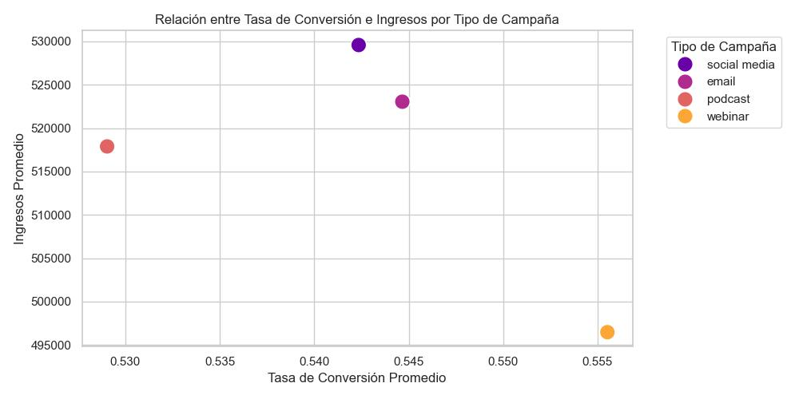

 

---

3️⃣ **¿Cómo se distribuye el ROI entre las campañas? ¿Qué factores están asociados con un ROI alto?**

* Según el Histograma la mayoría de los valores de ROI se concentran entre 0.3 y 0.7, con una ligera asimetría a la derecha.
* No hay una relación clara: campañas con ROI alto pueden tener presupuestos bajos o altos.

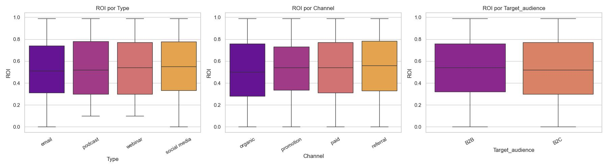
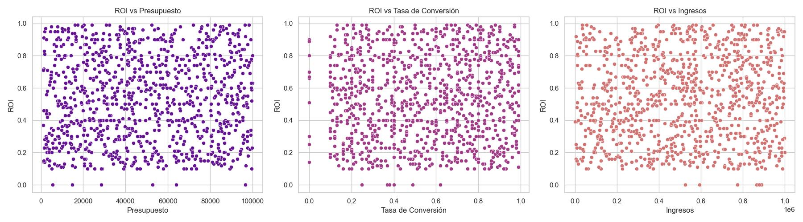

* El ROI está más relacionado con el canal de difusión, o el público objetivo que con otros datos.

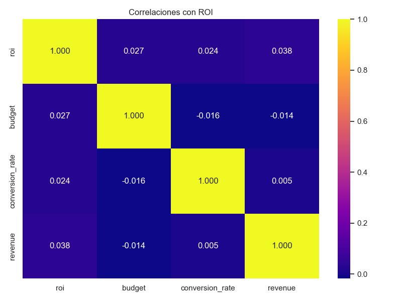

 

---

4️⃣ **¿Hay diferencias significativas en la tasa de conversión entre audiencias B2B y B2C?**

* Ambas audiencias presentan una distribución similar.B2B muestra una ligera tendencia a tener una conversión más alta, pero la diferencia no es drástica visualmente.

* Algunas campañas como Webinar y Email muestran una mayor diferencia a favor de B2B.

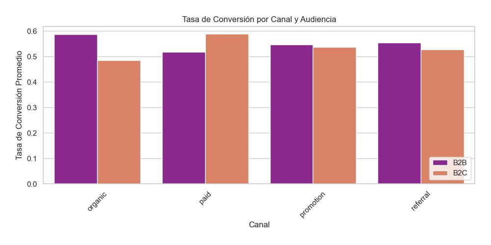

* Las diferencias entre B2B y B2C se hacen más visibles entre los canales Organic y Paid, y menos entre Promotion y Referral.

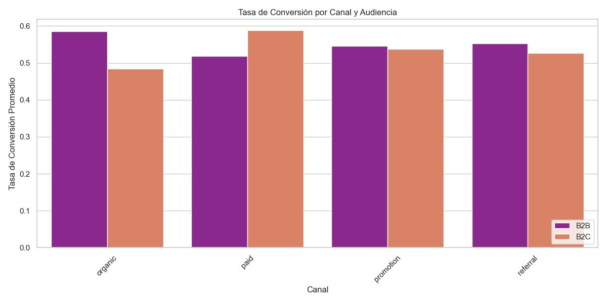

 

---

5️⃣ **¿Qué campaña tiene el mayor beneficio neto (nuevo campo: `net_profit`)? ¿Qué características la hacen exitosa?**

|  | Nombre de la campaa | Beneficio | ROI |
| - | - | - | - |
| 🥇 | Advanced systematic complexity | 987859.73 | 0.95 |
| 🥈 | Balanced optimizing software | 987359.82 | 0.95 |
| 🥉 | Object-based didactic intranet | 979827.40 | 0.64 |

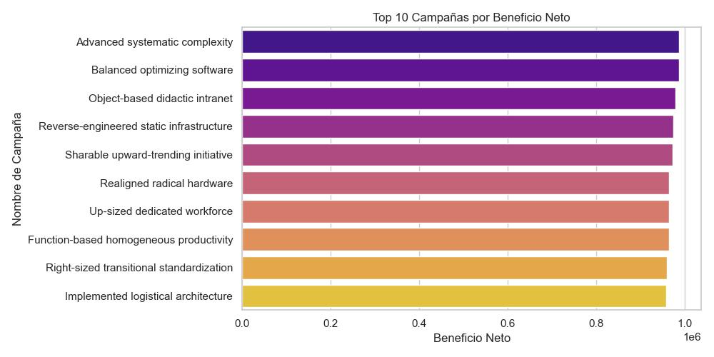

Entre las campañas de mayor beneficio neto, estacan las siguientes características:
* Podcast y Social Media
* Ambas audiencias (B2B y B2C) están representadas

 

---

6️⃣ ¿Existe correlación entre el presupuesto (budget) y los ingresos (revenue)?

* En el gráfico general y los segmentados por tipo de campaña, se observa una gran dispersión: algunas campañas con bajo presupuesto generan altos ingresos, y viceversa.

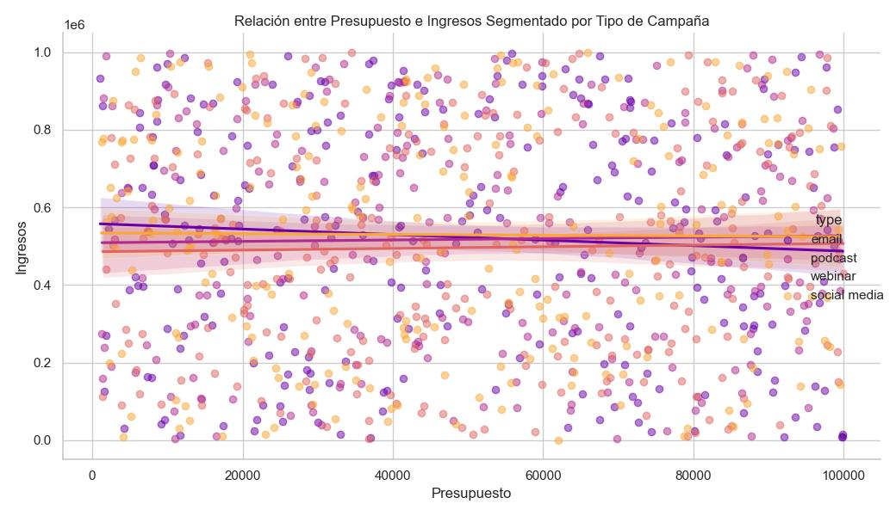

* No se aprecia un punto óptimo claro de inversión; más bien, el rendimiento parece depender más de otros factores como canal, audiencia o contenido de la campaña.

Es más recomendable segmentar estrategias según canal y tipo de campaña para maximizar el desempeño en cada audiencia.

 

---

7️⃣ ¿Qué campañas tienen un ROI mayor a 0.5 y ingresos encima de 500,000?

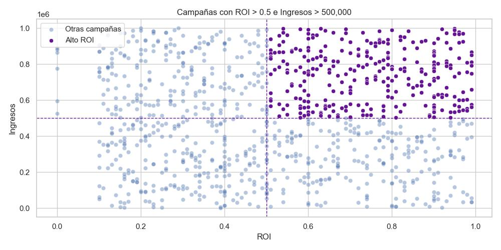

Datos estadísticos de las mejores campañas

| | roi | revenue | budget | net_profit | conversion_rate |
| :-: | -: | -: | -: | -: | -: |
| count | 305.000 | 305.00 | 305.00 | 305.00 | 305.000 |
| mean | 0.746 | 743962.31 | 49690.24 | 694272.07 | 0.543 |
| std | 0.145 | 148217.64 | 28297.27 | 149218.55 | 0.270 |
| min | 0.510 | 502557.55 | 1223.82 | 414225.75 | 0.000 |
| 25% | 0.610 | 601987.53 | 26628.67 | 554534.35 | 0.300 |
| 50% | 0.740 | 761292.13 | 47906.32 | 703680.75 | 0.570 |
| 75% | 0.890 | 865565.75 | 75067.13 | 823928.21 | 0.780 |
| max | 0.990 | 997657.18 | 99324.90 | 987859.73 | 0.990 |

* Predominan los canales promotion, organic y paid.

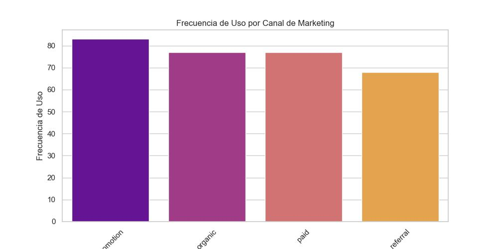

* Los tipos más comunes son email, podcast, y webinar.

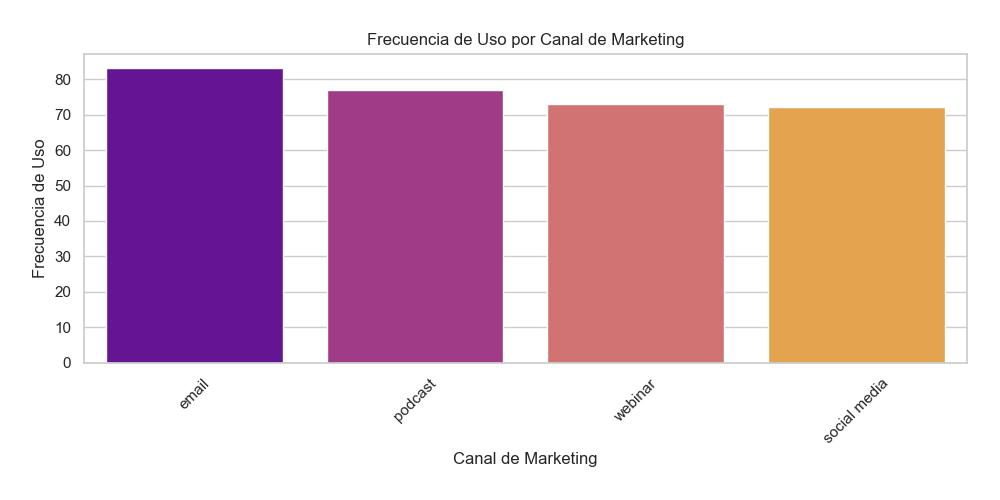

 

---

8️⃣ ¿Existen patrones estacionales o temporales en el rendimiento de las campañas?

* Ingresos tienen picos en algunos meses (por ejemplo, abril y noviembre), aunque no siguen una curva clara.

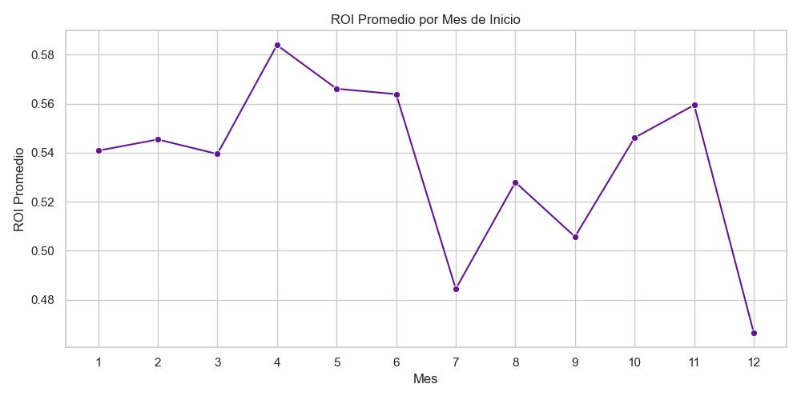

* El comportamiento varía según el tipo, lo que sugiere que la estacionalidad no es universal, sino dependiente del tipo de campaña.

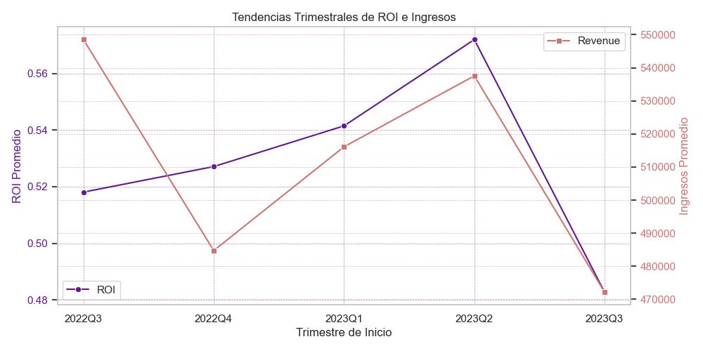

 
 

---

**Autor**: Pablo Bertrán de Lis

**Trabajo realizado para**: Upgrade Hub

 **Hub it all!**